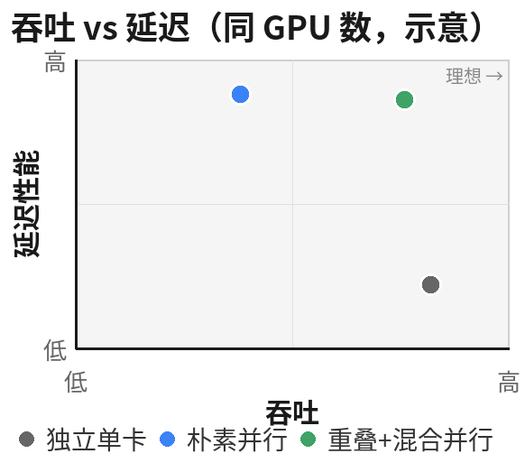

# 分离式 Diffusion Serving：Background 与 Motivation（结论稿）

> 实验环境：单节点 8×A10（24GB），Wan 系列蒸馏模型，分离式 encoder / transformer / decoder 流水线。  
> 详细 benchmark 与 lps sweep 见 [`motivation.md`](motivation.md)；原始数据见 `save_results/optimization_study/`。

---

## 1. Background

### 1.1 问题场景

我们正在构建一套**分离式（disaggregated）diffusion 视频生成服务**。系统将推理流水线拆分为独立阶段——文本/图像编码（encoder）、去噪 Transformer（denoise）、视频解码（decoder）——各阶段可部署在不同 GPU 或节点上，通过调度器接收并路由请求。

每个请求携带**异构参数**：分辨率（如 480×832 至 2048×2048）、帧数、步数、模型规模（1.3B / 14B MoE 等）、是否 I2V/T2V 等。不同组合导致单次请求的 compute 量、显存占用和端到端延迟差异巨大。

### 1.2 优化目标

服务的核心目标是在**保证尽可能高的 SLO 满足率**（例如 p95 端到端延迟低于给定阈值）的前提下，同时：

1. **提高系统吞吐**——单位时间内完成更多请求；
2. **降低单请求延迟**——尤其对延迟敏感的在线请求。

这两个目标在同一请求上存在张力：**请求内并行**（多卡 SP）可以降低单请求延迟，但会损害系统整体吞吐。为单个请求分配更多 GPU 能压缩去噪时间（P=4：74 s→25 s），但 P 张卡在同一时刻只服务一个请求，等价单卡槽位从 P 降至 `η`（扩展效率），集群可同时完成的请求数下降（8 卡 P=8 单路仅 0.075 req/s，vs 8 路独立单卡理想 0.110 req/s）。

我们的研究围绕：在分离式架构下，如何针对异构请求选择**并行度 P** 与**通信重叠**策略，在满足 SLO 的同时尽量回收并行带来的吞吐损失。

### 1.3 基线现状（Phase 0）

在现有分离式部署（Wan2.2-MoE I2V 蒸馏，480×832，4 denoise steps）上，**单卡、单请求**基线为：


| 指标                  | 数值                          |
| ------------------- | --------------------------- |
| 平均 E2E 延迟           | **91.0 s**                  |
| Transformer 去噪（P=1） | **74.5 s**（占 E2E **81.8%**） |
| Encoder             | 5.7 s（6.3%）                 |
| Decoder             | 9.7 s（10.7%）                |


**关键观察**：

- **去噪阶段是绝对瓶颈**，占 E2E 超过八成；单卡去噪 **74.5 s** 对紧 SLO（如 30–40 s 量级）不可达。
- 水平扩容（多副本单卡 transformer）只能增加可同时服务的请求数，**不能缩短单个请求的去噪时间**。
- 要在单请求维度降低延迟，必须在**请求内部**引入多卡并行（SP）；而并行度 P 的选择又直接决定集群吞吐上限——这是本文关注的核心矛盾。

---

## 2. Motivation

同 GPU 数下的公平比较：**独立单卡**并行占满吞吐上限但单路延迟高；**朴素并行**（SP 单请求）显著降低延迟但相对理想上限吞吐受损；**重叠 + 混合并行**在保留低延迟的同时将吞吐补回接近独立单卡水平。



### 2.1 核心矛盾：SLO 要求多卡，多卡损害吞吐

许多请求的 SLO 在单卡上无法达成。以当前基线为例，单卡 transformer 去噪约 **74 s**；若 SLO 目标为 30–40 s 量级，必须借助多卡并行（如 Ulysses Sequence Parallel，SP）将去噪时间压缩。

我们在 Wan2.2-MoE I2V（480×832，4 steps）上实测 Ulysses SP 扩展：


| SP 并行度 P | 去噪时间   | 加速比   | 扩展效率  | NCCL 占 CUDA% |
| -------- | ------ | ----- | ----- | ------------ |
| 1        | 73.6 s | 1.00× | 100%  | 0%           |
| 2        | 44.1 s | 1.67× | 83.5% | 28.0%        |
| 4        | 25.3 s | 2.91× | 72.6% | 35.4%        |
| 8        | 14.4 s | 5.11× | 63.8% | 33.3%        |


P=4 可将去噪从 74.5 s 降至 **25.3 s**，叠加 encoder/decoder 后阶段和约 **40.7 s**（vs 今天 89.9 s，约 **2.2×**）；P=8 可进一步至 **29.8 s** 阶段和（约 **3.0×**）。**多卡 SP 是满足延迟 SLO 的必要手段。**

然而，多卡并行并非免费午餐：

- **扩展效率低于 100%**：P=4 仅 72.6%、P=8 仅 63.8%，每步实际耗时高于朴素理想 `T₁/P`。
- **GPU 占用翻倍**：P=4 需 4 卡协作完成**一个**请求，同样 8 卡集群上可同时服务的「单卡等价请求数」下降。
- **系统吞吐上限**：若扩展效率为 η，P 卡并行处理 1 请求的吞吐等价于 `η/P` 个单卡槽位，低于理想的 `1/P`。

因此，问题不仅是「如何用多卡降低延迟」，更是「**如何在用多卡满足 SLO 的同时，尽量减少并行带来的吞吐损失**」。

---

### 2.2 小模型：低分辨率下通信是主要矛盾，重叠可补齐吞吐

对于**小模型、低分辨率**请求，单次去噪的 compute 窗口很短，Ulysses 每层 `all_to_all` 的**通信与同步开销在 wall time 中占比很高**，成为扩展效率的主要拖累。

**分辨率对 SP 效率的影响**及按并行度分解（P=2/3/4/6）详表见 [`motivation.md`](motivation.md) §2.2。

规律清晰：**分辨率越低，compute 越短，comm/sync 占比越高，SP 效率越差**；分辨率升高后 attention 的 O(S²) compute 迅速膨胀，通信相对可被「淹没」，扩展效率趋近 100%。

在典型在线分辨率（T2V-1.3B，480×832）上，P=2 单请求效率约 **83%**（comm **32%**）、P=3 **76%**（**41%**）、P=4 **75%**（**44%**）、P=6 **71%**（**43%**；P=1 comm 为 0%）。损失分解（P=4）显示：compute 本身已接近线性 4× 加速，**净损失主要来自 NCCL 无法完全 overlap 的关键路径**（约 +0.34 s/step，占 gap 111%）。

**应对思路：通信-计算重叠（comm overlap）。** 在单请求 SP 路径上，comm 已部分与 compute 重叠（约 0.36 s/step）；进一步地，可在**同一 SP 组内调度两个请求**（双租户），让一个请求的 `all_to_all` 等待窗口被另一个请求的计算填满。

实测（T2V-1.3B，480×832，4 steps，无 offload；各并行度下分别测 **单请求 SP** 与 **双请求 a2a-overlap**）：


| SP P | 模式 | 单请求去噪 (s) | wall (s) | 吞吐 (req/s) | comm 占比 | vs 同卡数独立 P=1 |
| ---: | --- | ---: | ---: | ---: | ---: | ---: |
| **1** | 单请求 | **14.9** | 14.9 | 0.067 | 0% | **100%** |
| **1** | 双请求 overlap | — | — | — | — | —（无 NCCL，不适用） |
| **2** | 单请求 | **9.0** | 9.0 | 0.111 | 32% | **83%** |
| **2** | 双请求 a2a-overlap | 9.0（每路；**~14.7 s**） | **14.7** | **0.136** | 32% | **~101%** |
| **3** | 单请求 | **6.5** | 6.5 | 0.153 | 41% | **76%** |
| **3** | 双请求 a2a-overlap | 6.5（每路；**~9.9 s**） | **9.93** | **0.201** | 41% | **~100%** |
| **4** | 单请求 | **5.0** | 5.0 | 0.200 | 44% | **75%** |
| **4** | 双请求 a2a-overlap | 5.0（每路；**~7.4 s**） | **7.40** | **0.270** | 44% | **~101%** |
| **6** | 单请求 | **3.5** | 3.5 | 0.287 | 43% | **71%** |
| **6** | 双请求 a2a-overlap | 3.5（每路；**~5.0 s**） | **5.00** | **0.400** | 43% | **~100%** |

「vs 同卡数独立 P=1」= 实测吞吐 / 同 GPU 数下 **N 路互不干扰的单卡 P=1 并行**理想吞吐 **N/T₁**（T₁=**14.9 s**；2 卡 **0.134**、3 卡 **0.202**、4 卡 **0.268**、6 卡 **0.403 req/s**）。双请求 wall 为 **2 req in-flight** 的总完成时间；每路有效延迟约等于 wall（两路流水线重叠完成）。

数据来源：`p3_t2v_1.3b_sp_seqp{1,2,3,4,6}.json`（单请求去噪）；`p3_dual_overlap_t2v_1.3b_seqp{1,2,3,4,6}.json`（双请求 a2a-overlap）。

规律一致：**并行度越高，单请求 SP 的 comm 占比与吞吐损失越大**（P=2 损失 17%、P=3 损失 24%、P=4 损失 25%、P=6 损失 29%）；**双租户 a2a-overlap 在各 P 上均将吞吐补回至 N 卡独立 P=1 理想水平**（P=2–6 均 **~100%**），同时保留 SP 延迟收益（14.9 s → 9.0 / 6.5 / 5.0 / 3.5 s）。

> **小结（小模型）**：低分辨率 → comm 占比高 → SP 单请求效率随 P 下降；双租户 comm overlap 在 P=2–6 上均可把系统吞吐恢复到与同卡数独立单卡相当的水平。

---

### 2.3 大模型：offload 使重叠失效，需另寻出路

对于**大模型**（如 Wan2.2-MoE I2V 14B），单卡 24GB 显存无法容纳完整权重，必须使用 **CPU offload**（`cpu_offload=true`，block/model 粒度）。此时 GPU 在执行计算的间隙需要**持续从 CPU/PCIe 加载权重**，显存带宽和 PCIe 带宽被权重搬运占满。

在这种条件下，comm overlap 的收益**急剧下降**：


| 配置                               | 2 请求 a2a-overlap 吞吐 | vs a2a-serial | vs 纯计算上限     |
| -------------------------------- | ------------------- | ------------- | ------------ |
| T2V-1.3B，无 offload               | **0.269 req/s**     | **1.07×**     | **~100%** 上限 |
| MoE I2V，block offload            | 0.040 req/s         | **1.04×**     | **~63%** 上限  |
| MoE I2V，model offload（disagg 风格） | 0.044 req/s         | **1.03×**     | **~79%** 上限  |


MoE 场景下，双租户 overlap 仅带来 **3–4%** 的额外收益（one-step pair overlap fraction 仅 **3–5%**），远低于小模型的 **35%**。根本原因是：**offload 的权重加载与 NCCL 通信争抢同一 GPU 带宽**，留给 overlap 的「计算空窗」极小。

同时，大模型 SP 的损失结构与小模型不同。Wan2.2-MoE I2V P=4 每步损失 **1.59 s**（4 步共 6.37 s），分解为：


| 模块                 | P=4 超额（vs 理想 T₁/4） | 占 gap |
| ------------------ | ------------------ | ----- |
| FFN                | **+1.01 s**        | 64%   |
| cross Q/O/attn     | **+0.62 s**        | 39%   |
| cross K/V（固定，未 SP） | +0.07 s            | 4%    |
| self-attn（Ulysses） | −0.12 s            | 抵消    |


主因是 **FFN 与 cross-attn 的 int8 GEMM 在 local batch M=8190 时效率低于 P=1 的 M=32760**，再叠加 NCCL 与权重加载对带宽的争用——属于**计算效率损失**，而非单纯 comm 关键路径（与小模型 T2V 的 44% comm 主导形成对比）。

**分辨率对 SP 效率的影响**及按并行度分解（P=2/4/8）详表见 [`motivation.md`](motivation.md) §2.3.0。

与小模型（§2.2，无 offload）对比：**同分辨率下大模型 SP 扩展效率显著更低**（256² P=4：**29%** vs 小模型 **58%**；512² P=4：**68%** vs **72%**），因 block offload 的权重搬运与 NCCL 争抢 PCIe/显存带宽；分辨率升高后 compute 占比上升，1024² 上 P=4/8 仍可维持 **~84–89%**。在线分辨率 480×832 介于 512² 与 1024² 之间，下节 §2.3.1 中 SP P=4 实测扩展效率 **~73%** 与此一致。

> **小结（大模型 + offload）**：通信重叠无法有效回收吞吐；损失来自 offload 带宽饱和 + 小 batch GEMM 效率下降。需要从根本上改变「单请求的资源使用方式」或「请求的并行度分配策略」。

#### 2.3.1 大模型并行方案对比总表（Wan2.2-MoE I2V 14B，480×832，4 steps，无 offload）

大模型单卡 24GB 塞不下权重时，SP 双租户 overlap 失效（上节）；以下探索 **PP / PP×SP / PP×SP quad** 路径——权重按 stage 切分到多卡、`cpu_offload=false`。表中 **SP/TP 行** 亦为大模型 MoE 实测，供对照；**PP 系仅列各 lps sweep 吞吐最优配置**，全量 lps 见 [`motivation.md`](motivation.md) §2.3.2–§2.3.4、§2.3.6。

统一口径：**单请求去噪** = `transformer_compute_s`（scheduler.prepare + denoise loop，不含 load/encoder/decoder）。**重叠后吞吐** = 同一并行组内 **2 个 in-flight 请求**完成时的 `2 / wall_s`（集群 req/s）；**quad 行**为 **4 req** 完成时的 `4 / wall_s`。**理想上限** = 同 GPU 数下 **N 路互不干扰的单卡 P=1 并行**：`N / T₁`；MoE 在 A10 上 **T₁ 一律取 block-offload P=1 实测**（480×832 **72.6 s**，见 `p3_sp_seqp1.json`；与 §2.3.0 正方形分辨率表同列）。PP×SP 多卡路径 `cpu_offload=false`，但扩展效率分母仍用该 T₁，表示相对「N 张卡各跑一路 block-offload 单卡」的吞吐比。

| 配置 | GPU | 单请求去噪 (s) | 重叠 wall | 重叠后吞吐 (req/s) | vs 同卡数独立 P=1 | 重叠机制 | 配置要点 |
| --- | ---: | ---: | ---: | ---: | ---: | --- | --- |
| **单卡 P=1** | 1 | **72.6** | 145.3（b2b 2 req） | **0.0138** | 100% | 无 NCCL | block offload |
| **SP P=2** | 2 | **43.4** | **86.3**（2 req） | **0.0232** | **84%** | dual **a2a-overlap** | block offload |
| **TP P=2** | 2 | **57.9** | 115.3（b2b；overlap **OOM**） | **0.0174**（b2b） | **64%** | 6-phase / AR-overlap **失败** | **无 offload** |
| **PP P=2，lps=2** ★ | 2 | **70.6** | **77.0**（2 req） | **0.0260** | **94%** | GPipe m=2，20 stage | **无 offload** |
| **SP P=4** | 4 | **24.5** | **50.5**（2 req） | **0.0396** | **72%** | dual **a2a-overlap** | block offload |
| **PP×SP P=2×2，lps=2** ★ | 4 | **43.0** | **46.1**（2 req） | **0.0434** | **79%** | GPipe m=2 + SP Ulysses | **无 offload** |
| **PP×SP quad P=2×2，lps=2** ★ | 4 | **42.8** | **83.8**（4 req） | **0.0478** | **86.8%** | GPipe m=2 + SP a2a | **无 offload** |
| **PP×SP P=2×4，lps=2** | 8 | **23.8** | **24.8**（2 req） | **0.0807** | **73%** | GPipe m=2 + SP Ulysses | **无 offload** |
| **PP×SP quad P=2×4，lps=2** ★ | 8 | **23.8** | **42.3**（4 req） | **0.0946** | **86.0%** | GPipe m=2 + SP a2a | **无 offload** |
| **SP P=8** | 8 | **13.3** | — | — | — | 未测 dual overlap | block offload |

★ = 该方案 lps sweep 吞吐最优；其余 lps 见下表。

**术语**：

- **lps**（`pp_layers_per_stage`）：每个 PP stage 计算的 Transformer 层数；lps 越小 stage 切分越细，GPipe bubble 越小，但 P2P 次数增多。
- **PP×SP**：在 `pipe_p` 维用 **GPipe 流水线重叠**（2 请求填 PP bubble）；`seq_p` 维为标准 Ulysses SP，**不做**跨请求 comm overlap。
- **PP×SP quad**：**PP 与 SP 均做流水线重叠**——`pipe_p` 上 GPipe m=2 微批；`seq_p` 上每微批内 **1 对** SP a2a dual overlap（**4 req**：mb0 对 (0↔1)、mb1 对 (2↔3)；P=2×2 亦为 4 req，对 (0↔2)、(1↔3)）。

数据来源：`p3_sp_seqp{1,2,4,8}.json`；`p3_dual_overlap_seqp{2,4}.json`；`wan22_distill_tp2_fair.json`；`wan22_pp_lps_sweep.json`；`wan22_pp2_sp2_hybrid_lps*_m2_fixed.json`；`wan22_pp2_sp2_quad_overlap_lps*.json`；`wan22_pp2_sp4_hybrid_lps2_m2.json`；`wan22_pp2_sp4_dual_quad_lps*.json`。详表见 [`motivation.md`](motivation.md)。

**读表要点**：

1. **买延迟**：SP P=2/4 单请求 **43 s / 25 s**，远快于 TP=2（**58 s**）和 PP coarse（lps=20 时 dual ~106 s，见 [`motivation.md`](motivation.md) §2.3.2）。
2. **买吞吐（2 卡）**：PP **lps=2** GPipe（**0.0260 req/s，94%**）优于 SP a2a-overlap（**0.0232，84%**）和 TP b2b（**0.0174，64%**）。
3. **买吞吐（4 卡）**：**quad P=2×2 lps=2**（**0.0478，86.8%**）为当前 4 卡 MoE I2V 无 offload 最优；高于 SP P=4 dual（**0.0396，72%**）和 hybrid **lps=2**（**0.0434，79%**）；quad 需 **4 路并发**。
4. **买吞吐（8 卡）**：**quad P=2×4 lps=2**（**0.0946，86%**）为 8 卡无 offload **吞吐最优**（★）；**hybrid 2-req**（**0.0807，73%**）每路延迟 **~25 s**（≈单请求 **24 s**），适合低延迟；quad 需 **4 路并发**，每路 **~42 s**。
5. **lps 选型**：PP / hybrid / quad（P=2×2 与 P=2×4）均在 **lps=2** 达吞吐最优；更细（lps=1）或更粗（lps≥5）均不如 lps=2（sweep 见 [`motivation.md`](motivation.md)）。
6. **配置不完全同质**：SP 行 **block offload**；TP/PP/PP×SP **无 offload**。不宜抠 0.1 s 绝对差。
7. **不采用 TP**：同卡数 SP 单请求更快、多卡可继续扩展；TP 双租户 overlap E2E 无收益（详见 [`motivation.md`](motivation.md) §2.4）。

#### 2.3.2 PP×SP quad P=2×4（8 GPU，4 req）结论

4 请求 in-flight（每 PP 微批 1 对 SP dual overlap）；**lps=2** 吞吐最优（**0.0946 req/s，86%** 理想），单请求去噪 **23.8 s**，每路延迟 **~42 s**。相对 8 req 全配对方案，4 req **吞吐更高、每路延迟减半**。全量 lps sweep 见 [`motivation.md`](motivation.md) §2.3.6。

---

### 2.4 并行度调度——在资源约束下最大化 SLO 满足率

并非每个请求都需要相同的并行度 P。低分辨率、小模型请求在 P=4 上已接近线性加速且 comm overlap 可补齐吞吐；高分辨率请求 compute 足够长，comm 占比低，SP 效率本身已达 95%+，无需额外 overlap；大模型 offload 请求则 overlap 收益甚微，强行高 P 可能浪费 GPU 资源。

这自然将问题建模为**调度问题**（详见 `lightx2v/disagg/dynamic_sp_scheduling_plan.md`）：

> 给定固定 GPU 分区与槽拓扑，在 encode 完成后的 **ready_pool** 与当前 **空闲叶槽** 之间，为每个请求匹配并行度 `p` 与 `member_ranks`，**最大化按时完成率**；Admission 阶段对不可行请求直接 **reject**。

**Admission（粗筛，不占槽）**：用标定的 `T_i(p)` 预测 `finish_admission(i)`；若 `finish_admission(i) > deadline_i` 则拒绝，否则进入 pending / request ring。

**Batch placement（攒批后细配）**：对每个 partition，在候选拓扑 `π'` 上建二部图——左侧为 ready 请求，右侧为空闲叶槽；边 `(i, s)` 存在当且仅当：

1. 请求 i 在槽 s 的 `p` 下所需的 `member_ranks` 与槽完全一致；
2. `finish_at_phase1(i, p_s) ≤ deadline_i`（用 `T_i(p)` + 阶段排队压力估计）。

边**费用**（与设计稿一致，不是「违约惩罚 + 资源占用时间」）：

```text
cost(i, s) = -(w₁ · urgency(i) + w₂ · fit_p(i, p_s))

urgency(i) = 1 / max(laxity(i), ε)          # 紧急度：余量越小越优先
fit_p(i, k)  ≈ (T_i(1) - T_i(k)) / T_i(1)  # 适配度：该请求在 k 卡上的加速收益
```

用 **min-cost max-flow** 求解，目标为**字典序**：

1. **最大流量**——尽可能多的请求获得可行槽位（按时完成数优先）；
2. **最小总费用**——在最大流量前提下，优先匹配「更紧急 + 更适配该 p」的 `(i, s)`；
3. **拓扑罚项**——split/merge 变更附加 `split_penalty` / `merge_penalty`。

未匹配请求留在 ready_pool；高 `p` 占槽多、降低集群并发容量，这一代价通过「流量优先 + fit_p 偏好合适 p」间接体现，而非把 GPU 占用时间直接写进边权。

以 8 卡集群为例（Phase 3 系统吞吐账本）：


| 部署方式                | 系统吞吐 (req/s) | vs 8 路独立单卡理想 |
| ------------------- | ------------ | ------------ |
| 8 路 P=1 并行（理想）      | 0.110        | 100%         |
| 2 组 P=4 SP（各 1 请求）  | 0.082        | 74.0%        |
| 1 组 P=8 SP（1 请求）    | 0.075        | 68.3%        |
| 2 组 P=4 双租户 overlap | **0.088**    | **79.5%**    |


可见，**不同 P 选择和 overlap 策略直接决定系统吞吐上限**；调度器若能为「低分辨率小模型」分配 P=4 + overlap 槽位、为「高分辨率」分配较低 P 或单卡槽位，有望在全局上优于「所有请求统一 P=4」的静态策略。

---

## 3. 研究问题总结


| 维度              | 挑战                  | 实验证据                      | 可能路径                                  |
| --------------- | ------------------- | ------------------------- | ------------------------------------- |
| **延迟**          | 单卡去噪 74 s，无法满足紧 SLO | Phase 0 基线                | 多卡 Ulysses SP（P=4 → 25 s）             |
| **吞吐 vs 并行**    | SP 扩展效率 64–75%，多卡占槽 | Phase 3 SP sweep          | comm overlap（小模型有效）；**PP×SP quad**（4 卡 **87%** / 8 卡 **86%** 理想，各 4 req） |
| **分辨率异构**       | 低分辨率 comm 主导，高效率差   | 256² P=4 58% vs 1024² 95% | 低分辨率才需 overlap                        |
| **大模型 offload** | 带宽饱和，overlap 仅 3–4% | MoE dual-overlap          | 调度降 P / 多副本；非 TP overlap              |
| **TP 可行性**      | 单请求不如 SP；P≥4 不扩展；双租户 overlap 负收益 | `wan22_distill_tp_fair_comparison`、E2E suite | **不采用**；默认 **SP**（`seq_p_size`）       |
| **全局最优**        | 请求参数异构，固定 P 浪费资源    | 8 卡吞吐账本                   | 攒批 min-cost max-flow（urgency + fit_p） |


**本文/本工作的核心动机**：在分离式 diffusion serving 中，多卡并行是满足 SLO 的必要手段，但会系统性损害吞吐；这一矛盾对小模型（低分辨率）和大模型（需 offload）的表现形式不同，需要**分场景**采用 comm overlap、**PP×SP 混合并行**、**Ulysses SP 并行度调度**，在延迟与吞吐之间取得最优权衡。**Tensor Parallel 经实测不适合作为 Wan MoE 的并行与双租户 overlap 方案**（详见 [`motivation.md`](motivation.md) §2.4）。

---

## 4. 待写章节（占位）

- **Design**：分离式架构 + **SP** 槽拓扑 + 双租户 overlap（小模型）+ 攒批 min-cost max-flow（urgency + fit_p）
- **Evaluation**：端到端 SLO 满足率、吞吐-延迟 Pareto 曲线、异构请求混合负载
- **Related Work**：disaggregated LLM serving、diffusion parallel（Ulysses/Ring）、TetriServe（per-request `p` 适配）；TP 详测见 [`motivation.md`](motivation.md) §2.4（已归档，不作生产路径）

